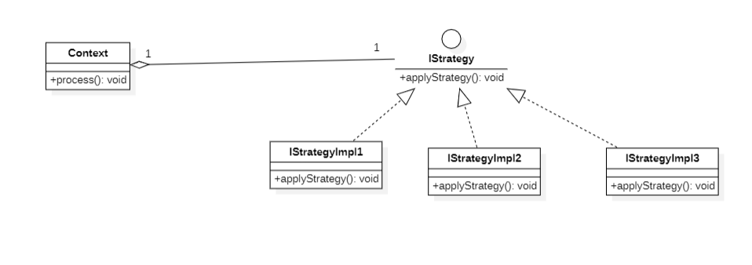

# Patron de Conception : Strategy (Stratégie)

Le **Patron de Conception Strategy** est un patron de conception comportemental qui définit une famille d'algorithmes, 
encapsule chacun d'eux et les rend interchangeables. Ce patron permet de faire varier l'algorithme indépendamment des 
clients qui l'utilisent.

## Vue d'ensemble
Le Patron Strategy permet de sélectionner le comportement d'un algorithme à l'exécution.
Au lieu d'implémenter directement un seul algorithme, le code reçoit des instructions au moment de l'exécution,
spécifiant lequel parmi une famille d'algorithmes utiliser.

## Diagramme de Classe

